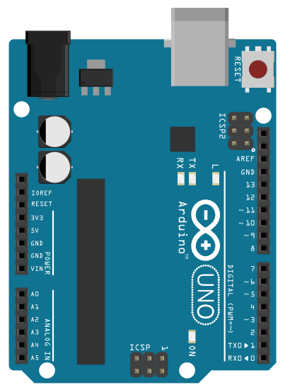
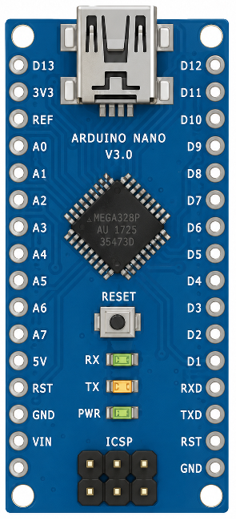
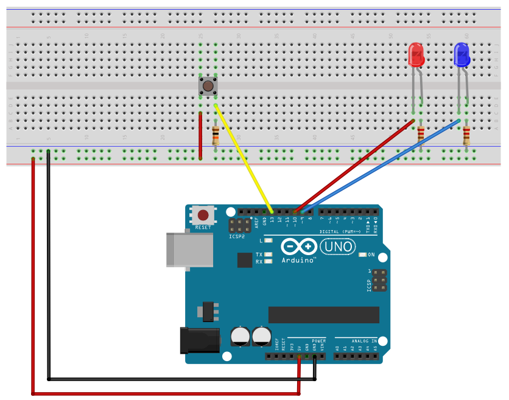

# Appendix A - Hardware-Near Programming in C

## A.1 What's different about embedded
* A microcontroller (MCU) is a complete computer with no screen or keyboard; I/O happens through
  pins wired to sensors and actuators (buttons, LEDs, motors, sensors).
* Your code is still compiled to machine code, but there's no OS between you and the hardware; you
  write directly to memory-mapped registers.
* C is the default choice here: predictable, tiny memory footprint, close to the metal, and still
  far more productive than assembly. A very skilled assembly programmer can occasionally beat a
  modern compiler, but rarely by much, and it's almost never worth it.

---

## A.2 The board: Arduino Uno/Nano
Either board works for this course: same **ATmega328P** chip, same registers, same PIN↔PORT
mapping for D0–D13 and A0–A5. The Nano just adds two extra analog-only pins (A6, A7) and drops
the barrel power jack.

The ATmega328P is an 8-bit AVR microcontroller with three I/O ports, each covering a group of
pins:

| Board pin | Register port |
|---|---|
| D0 – D7 | PORTD0 – PORTD7 |
| D8 – D13 | PORTB0 – PORTB5 |
| A0 – A5 | PORTC0 – PORTC5 |



Here's the Nano for direct comparison: different board outline and a Mini-USB connector instead
of the Uno's USB-B, but the same D0–D13/A0–A5 pin numbering and the same ATmega328P underneath:



PORTB and PORTD are purely digital I/O. PORTC is the analog-capable port (used with the ADC,
Lecture 4) but behaves as ordinary digital I/O when you're not doing analog reads.

For consistency, every breadboard circuit diagram in this appendix (and in
[Appendix C](./c_arduino_via_microchip_studio.md)) shows an Arduino Uno. If you're using a Nano,
wire it the same way: same chip, same D0–D13/A0–A5 pin numbering, the only difference is the
board outline and USB connector in the picture.

---

## A.3 Bitwise operations (this is the whole game)
There's no `digitalWrite()` here; you write directly to registers, and a register is just a byte,
so every pin operation is a bitwise operation on that byte.

| Operation | C operator | Effect |
|---|---|---|
| OR | `\|` | sets one or more bits, leaves the rest ("bitwise addition") |
| AND | `&` | reads a bit, or (with NOT) clears one ("bitwise multiplication") |
| NOT | `~` | inverts every bit |
| XOR | `^` | clears matching bits, sets differing bits |
| NOR | `~(a \| b)` | inverse of OR: bit set only where both operands are 0 |
| NAND | `~(a & b)` | inverse of AND: bit set unless both operands are 1 |
| XNOR | `~(a ^ b)` | inverse of XOR: bit set where operands match |

There's no single C operator for NOR/NAND/XNOR; you get them by combining `~` with `|`/`&`/`^` as
shown above. Don't confuse NAND with the clear-bit idiom below: `reg &= ~mask` is AND with a
*negated mask*, not a NAND of `reg` and `mask`; those are different operations that happen to
both involve `~` and `&`:
* Set bit 3 without touching the rest: `reg |= 0b00001000;`
* Clear bit 3 without touching the rest: `reg &= ~0b00001000;`

### Shifting
`1U << n` puts a single `1` in bit position `n`; this is how you address "which pin" without
hand-writing the bit pattern:

```c
#define LED1 1U         // D9 -> PORTB1.
PORTB |= (1U << LED1);  // Enable LED1.
PORTB &= ~(1U << LED1); // Disable LED1.
```

`x << n` and `x >> n` are also multiply/divide by `2^n`, if you ever need that framing.

---

## A.4 Driving an output, reading an input
* `DDRx` (**D**ata **D**irection **R**egister) decides, per bit, whether a pin is an output (`1`)
  or input (`0`).
* On an output pin, `PORTx` sets the pin high/low.
* On an input pin, `PORTx` instead enables (`1`) or disables (`0`) the internal pull-up resistor.
  With it enabled, the pin reads a clean `1` when unconnected/floating and `0` when pulled to
  ground, instead of floating unpredictably.
* To read the actual input level, read `PINx` (not `PORTx`).

```c
#define BTN1 5U                               // D13 -> PORTB5
#define BTN1_PRESSED (PINB & (1U << BTN1)) // High if BTN1 is pressed, low otherwise.
```

The button circuit used in A.5/A.6 doesn't actually rely on this internal pull-up: it wires an
**external pull-down** resistor instead (one leg to 5 V, a 10 kΩ resistor from that same leg to
GND, D13 tapped in between). That means D13 reads `0` when idle and `1` when pressed, the
opposite of the internal-pull-up pattern described above. The code still enables the internal
pull-up anyway (`PORTB = (1U << BTN1);`); that's harmless here, since the external 10 kΩ resistor
dominates the AVR's much weaker internal one (tens of kΩ) and keeps the idle reading at `0`, but
it isn't what makes this circuit work. It's there so you see `PORTx`'s input-mode behavior used
directly, even on a circuit that doesn't strictly need it.

---

## A.5 First program: LED follows a button
A LED is connected to D9, and a button is connected to D13. The button is continuously polled:
* The LED is enabled if the button is pressed.
* The LED is disabled if the button isn't pressed.


```c
#include <avr/io.h>

/** GPIO pins. */
#define LED1 1U // D9  -> PORTB1.
#define BTN1 5U // D13 -> PORTB5.

/** GPIO operations. */
#define LED1_ON PORTB |= (1U << LED1)         // Enable LED1.
#define LED1_OFF PORTB &= ~(1U << LED1)       // Disable LED1.
#define BTN1_PRESSED (PINB & (1U << BTN1)) // High if BTN1 is pressed, low otherwise.

/**
 * @brief Set up system.
 */
static void setup(void)
{
    // Configure LED1 as output.
    DDRB = (1U << LED1);

    // Configure BTN1 as input with its pull-up enabled.
    PORTB = (1U << BTN1);
}

/**
 * @brief Application entry point.
 *
 * @return 0 on termination of the program (should never occur).
 */
int main(void)
{
    setup();

    while (1)
    {
        // Read BTN1, enable LED1 if pressed, disable if not.
        if (BTN1_PRESSED) { LED1_ON; }
        else { LED1_OFF; }
    }
    return 0;
}
```

`LED1_ON`, `LED1_OFF`, and `BTN1_PRESSED` are the object-like and function-like macros covered in
[L01 Appendix A.12](../../L01/appendix/a_c_fundamentals.md#a12-macros-define): plain text
substitution, parenthesized throughout so each one behaves correctly no matter what surrounds it
at the call site.

You'll see a Doxygen comment above every non-trivial function throughout this codebase, written in
the imperative mood ("Configure...", "Compute...", not "Configures..." or "This function
configures...").

---

## A.6 Blinking two LEDs, with a hand-rolled delay
LEDs on D9/D10 alternate every 200 ms while the button on D13 is held; both off otherwise.



```c
#define F_CPU 16000000UL // CPU frequency in HZ.

#include <stdint.h>

#include <avr/io.h>
#include <util/delay.h>

/** GPIO pins. */
#define LED1 1U // D9  -> PORTB1.
#define LED2 2U // D10 -> PORTB2.
#define BTN1 5U // D13 -> PORTB5.

/** GPIO operations. */
#define LED1_ON PORTB |= (1U << LED1)      // Enable LED1.
#define LED1_OFF PORTB &= ~(1U << LED1)    // Disable LED1.
#define LED2_ON PORTB |= (1U << LED2)      // Enable LED2.
#define LED2_OFF PORTB &= ~(1U << LED2)    // Disable LED2.
#define BTN1_PRESSED (PINB & (1U << BTN1)) // High if BTN1 is pressed, low otherwise.

/** Time parameters. */
#define TICK_1MS 1U         // Generate 1 ms tick in delay_ms().
#define BLINK_SPEED_MS 200U // Blink speed in ms.

/**
 * @brief Set up system.
 */
static void setup(void)
{
    // Configure LED1 and LED2 as outputs.
    DDRB = (1U << LED1) | (1U << LED2);

    // Configure BTN1 as input with its internal pull-up enabled.
    PORTB = (1U << BTN1);
}

/**
 * @brief Generate delay.
 *
 * @param[in] ms Delay duration in ms.
 */
static void delay_ms(const uint16_t ms)
{
    for (uint16_t i = 0U; i < ms; ++i)
    {
        _delay_ms(TICK_1MS);
    }
}

/**
 * @brief Blink the LEDs.
 *
 * @param[in] blink_speed_ms Blink speed in ms.
 */
static void led_blink(const uint16_t blink_speed_ms)
{
    // Enable LED1, disable LED2.
    LED1_ON;
    LED2_OFF;
    delay_ms(blink_speed_ms);

    // Disable LED1, enable LED2.
    LED1_OFF;
    LED2_ON;
    delay_ms(blink_speed_ms);
}

/**
 * @brief Turn both LEDs off.
 */
static void leds_off(void)
{
    LED1_OFF;
    LED2_OFF;
}

/**
 * @brief Application entry point.
 *
 * @return 0 on termination of the program (should never occur).
 */
int main(void)
{
    setup();

    while (1)
    {
        // Read BTN1, blink the LEDs if pressed, disable both LEDs if not.
        if (BTN1_PRESSED) { led_blink(BLINK_SPEED_MS); }
        else { leds_off(); }
    }
    return 0;
}
```

A few things worth noting:
* `F_CPU` must be `#define`d *before* including `<util/delay.h>`, since the delay functions
  compute their loop counts from the clock frequency at compile time. The `UL` suffix avoids the
  value being truncated as a 16-bit `int` on this target.
* `<stdint.h>` is included explicitly for `uint16_t`, even though `<avr/io.h>` happens to pull it
  in already; include what you directly use rather than relying on a header's own includes, which
  can change.
* `_delay_ms()` only accepts a compile-time constant or macro as its argument, not a variable, so
  it can't take `ms` directly. `delay_ms()` works around this by calling `_delay_ms(TICK_1MS)` in
  a loop, incrementing a local counter each pass until it reaches `ms`.
* `_delay_ms()` (and by extension `delay_ms()`) **blocks** the entire program while it waits, fine
  for this example, but this exact limitation is what the Timers lecture (L05) exists to solve.

---
