# Appendix C - Arduino via Microchip Studio

## C.1 Why this workflow
If you don't have a dedicated ISP programmer, you can still flash a Microchip Studio build onto the
board: the Arduino bootloader already sits on the chip, and the Arduino IDE already knows the exact
`avrdude` command line needed to talk to it over your board's COM port. The trick is simply to
borrow that command line and point it at Microchip Studio's `.hex` output instead of the Arduino
IDE's own. Everything below builds toward one reusable "External Tool" entry in Microchip Studio
that does exactly that.

---

## C.2 Wire the circuit
Same layout as [Appendix A](./a_registers_and_io.md)'s first example: LED anode on D9 (through a
220 Ω-470 Ω resistor to ground, 330 Ω is a good middle value), button on D13 (one leg to 5 V, the
other to ground through a 10 kΩ resistor, with D13 tapped in series on that leg).

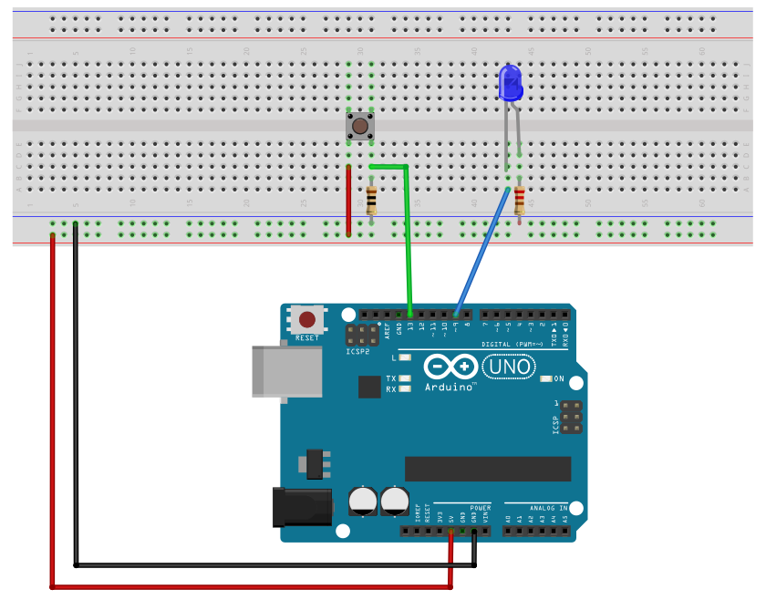

Like the diagrams in Appendix A, this one shows an Arduino Uno. If you're using a Nano instead:
same chip, same pin numbering, just a different board outline in the picture.

---

## C.3 Build and test the sketch in Arduino IDE
This step uses the Arduino libraries (C++, an abstraction layer this course doesn't otherwise use)
purely to get a known-working upload before touching Microchip Studio. Open the Arduino IDE, start
a new sketch (`File → New`), and replace its contents with:

```cpp
/** GPIO pins. */
#define LED1 9U  // D9.
#define BTN1 13U // D13.

/**
 * @brief Set up system.
 */
void setup()
{
    // Configure LED1 as output.
    pinMode(LED1, OUTPUT);

    // Configure BTN1 as input with its pull-up enabled.
    pinMode(BTN1, INPUT);
}

void loop()
{
    // Read BTN1, enable LED1 if pressed, disable if not.
    if (digitalRead(BTN1)) { digitalWrite(LED1, HIGH); }
    else { digitalWrite(LED1, LOW); }
}
```

This lights the LED on D9 while the button on D13 is held. It'll be rebuilt as real C in
[C.7](#c7-recreate-the-program-in-microchip-studio).

`pinMode()`, `digitalRead()`, and `digitalWrite()` are Arduino's abstraction over the
register-level I/O [Appendix A](./a_registers_and_io.md) covers directly: `pinMode(pin, mode)` sets
a pin `INPUT` or `OUTPUT` (a `DDRx` write), `digitalRead(pin)` returns `HIGH`/`LOW` for a pin's
current level (a `PINx` read), and `digitalWrite(pin, value)` sets an output pin `HIGH` or `LOW` (a
`PORTx` write). Underneath, the Arduino core implements all three with exactly the register
operations from Appendix A, just hidden behind a function call and a pin-number lookup table.

Turn on verbose upload logging, since the next step depends on reading `avrdude`'s exact command
line out of it: `File → Preferences`, then check the box next to "Show verbose output during:
Upload".

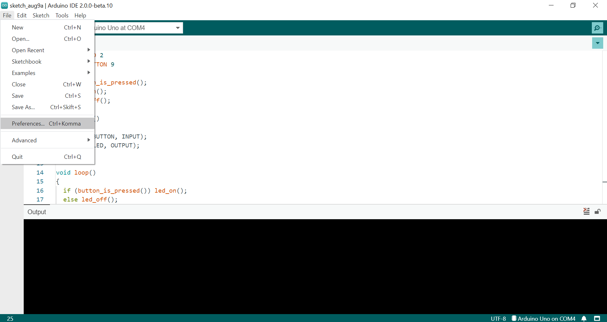

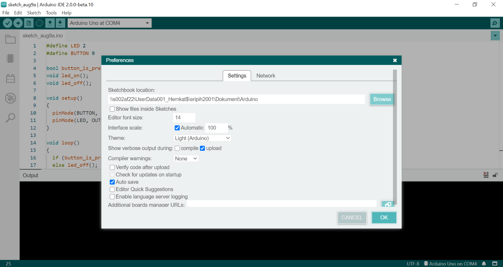

---

## C.4 Install the board package, select the board and port
Install the AVR board package if it isn't already: `Tools → Board → Board Manager`, then click
Install on "Arduino AVR Boards by Arduino" (skip this if it's already installed, as in the
screenshot below).

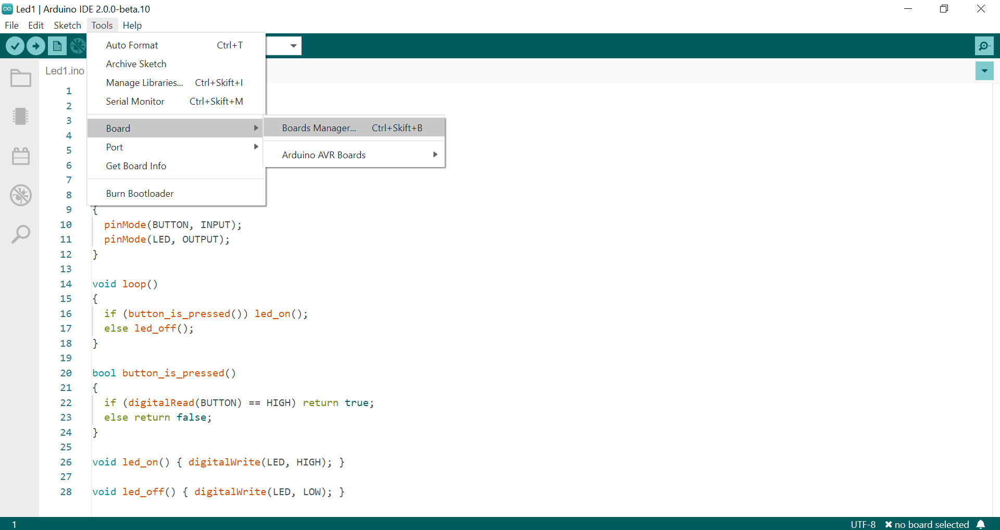

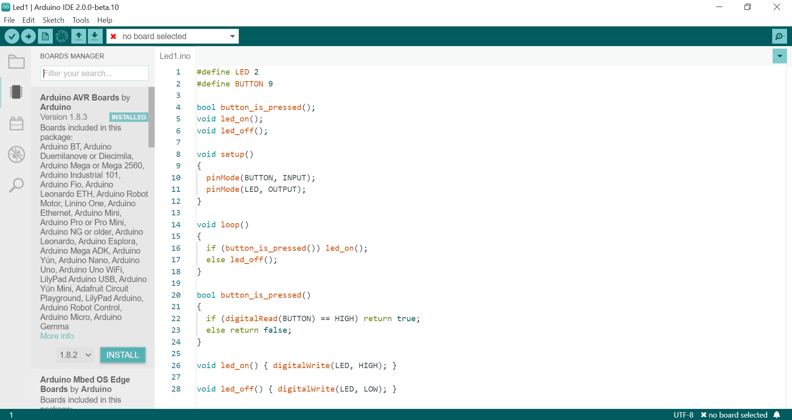

With the board connected, select it: `Tools → Board → Arduino AVR Boards → Arduino Uno`. Then
select its port: `Tools → Port`, and pick the COM port shown (e.g. COM4; the exact number doesn't
matter and can vary by machine).

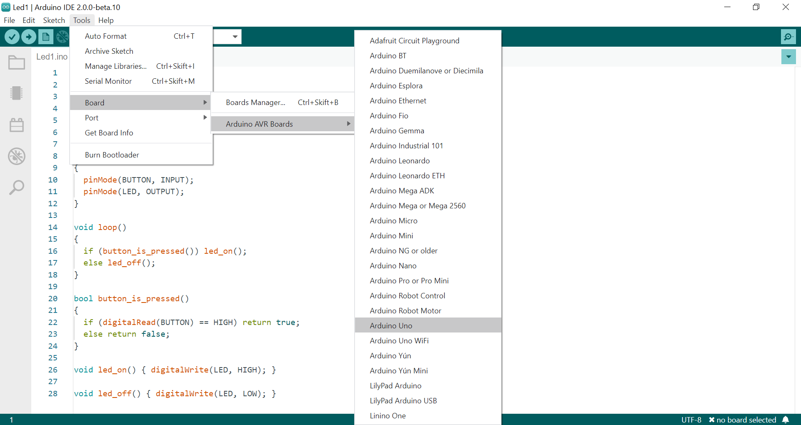

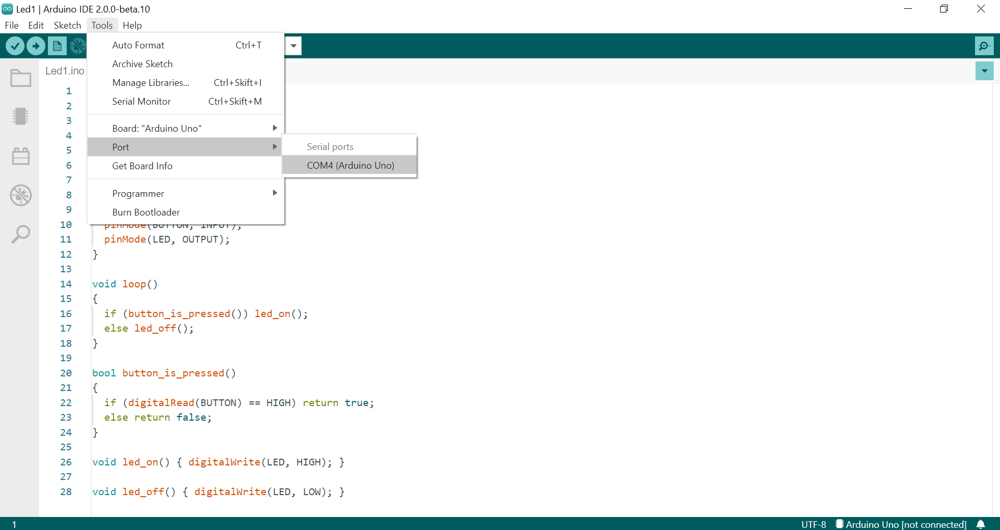

---

## C.5 Upload and read back avrdude's command line
Click Upload in the top-left corner.

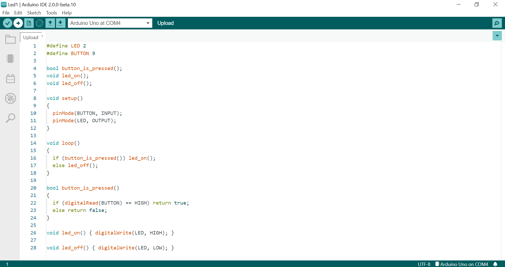

In the Output window (the black pane), scroll up to the line reading "Compilation complete." and
copy the file path on the line beneath it; it should look something like:

```
"C:\Users\eripih2001\AppData\Local\Arduino15\packages\arduino\tools\avrdude\6.3.0-arduino17/bin/avrdude"
"-CC:\Users\eripih2001\AppData\Local\Arduino15\packages\arduino\tools\avrdude\6.3.0-arduino17/etc/avrdude.conf"
-v -V -patmega328p -carduino "-PCOM4" -b115200 -D
"-Uflash:w:C:\Users\ERIPIH~1\AppData\Local\Temp\arduino-sketch4CE86550DB8430968B53E52972DC68D2/Led1.ino.hex:i"
```

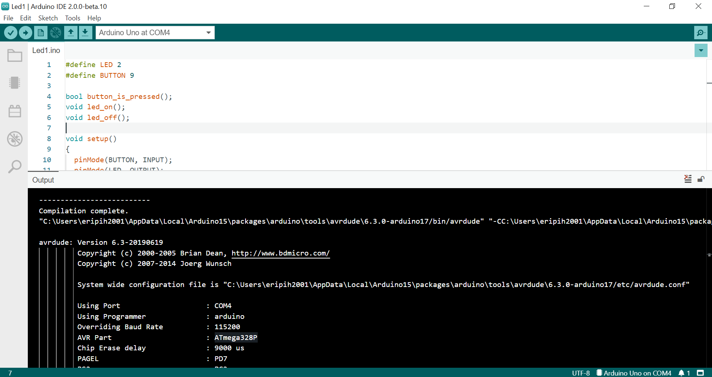

---

## C.6 Turn it into a reusable command
This is the fiddliest part, but it's a one-time setup: reshaping that copied line into a
command/arguments pair Microchip Studio's "External Tools" feature can invoke directly.

1. Open Notepad, paste the copied path in, and strip out all the quotation marks. Save it as
`Arduino via Microchip Studio.txt`.
2. After `bin/avrdude`, press Enter twice so the rest of the path lands two lines down.
3. Add the extension `.exe` after `avrdude` on the top line.

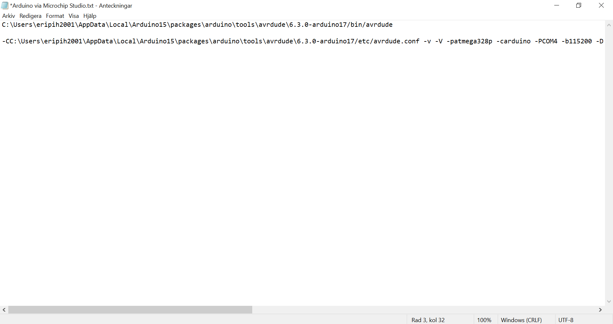


4. Far to the right on the second line, just before `-Uflash`, press Enter so the rest lands on a
new third line.
5. On the two bottom lines, add quotes around the two file paths (the ones starting with `C:\` and
ending in `.conf` and `.hex` respectively). Afterward the two lines should look roughly like:

```
-C"C:\Users\eripih2001\AppData\Local\Arduino15\packages\arduino\tools\avrdude\6.3.0-arduino17/etc/avrdude.conf" -v -V -patmega328p -carduino -PCOM4 -b115200 -D
-Uflash:w:"C:\Users\ERIPIH~1\AppData\Local\Temp\arduino-sketch4CE86550DB8430968B53E52972DC68D2/Led1.ino.hex":i
```

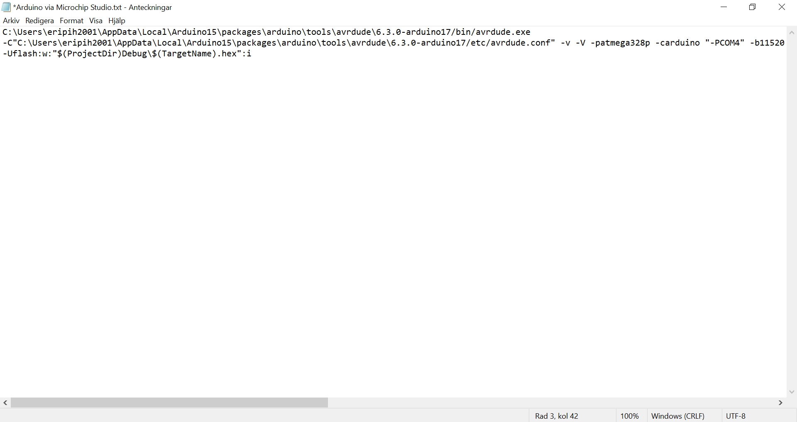

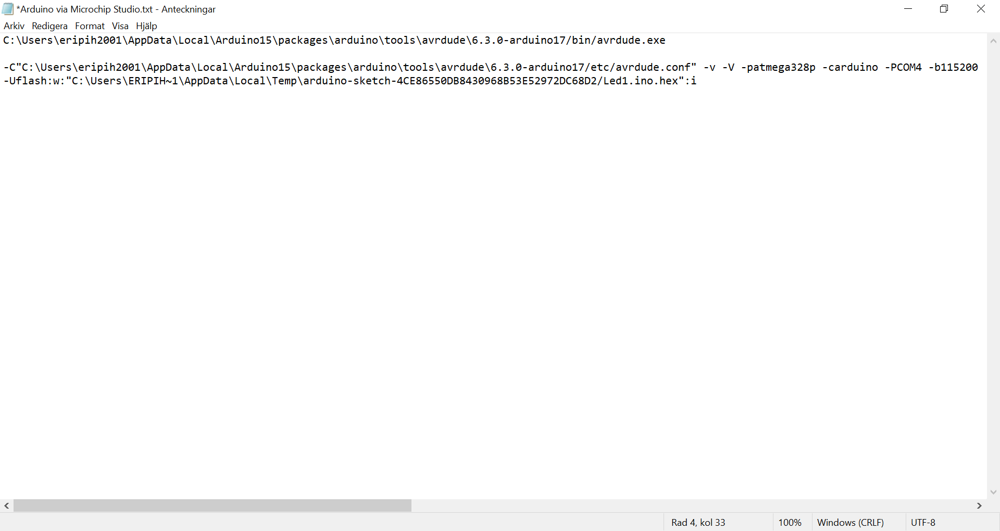

6. Cut the file path on the bottom line (the part after `-Uflash`, between the quotes ending in
`.hex`) and paste in `$(ProjectDir)Debug\$(TargetName).hex` instead: Microchip Studio expands these
build-variable placeholders to the actual output path at run time, so this line no longer needs to
change per project.
7. Merge the two bottom lines back into one: click at the very start of the last line (right before
`-Uflash`) and press Backspace. Only two lines should remain in total. Save the file.

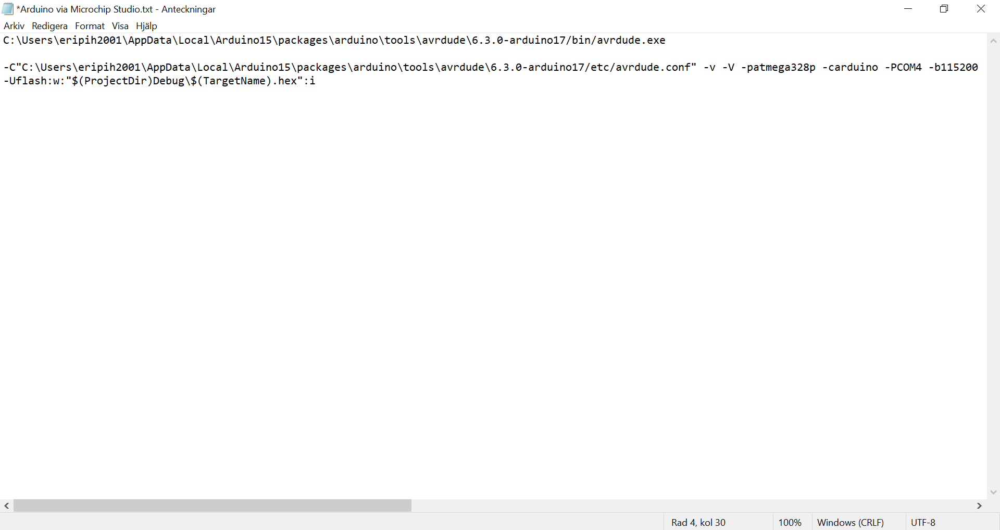


You now have two lines: the `avrdude.exe` path (the *Command*) and everything else (the
*Arguments*): ready to paste into Microchip Studio's External Tools dialog in
[C.8](#c8-wire-up-the-external-tool).

---

## C.7 Recreate the program in Microchip Studio
Open Microchip Studio and create a new **GCC C Executable Project**, named `Led1`.

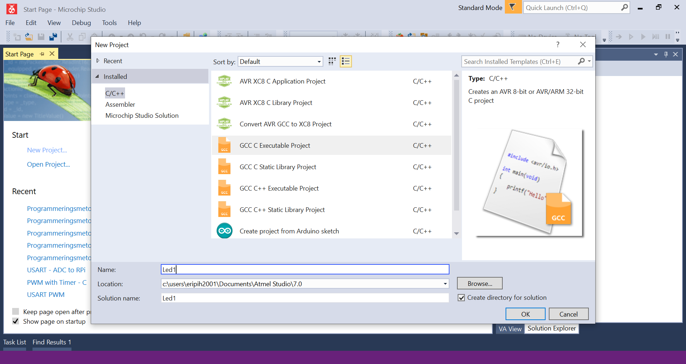

In the Device Selection dialog, choose **ATmega328P**.

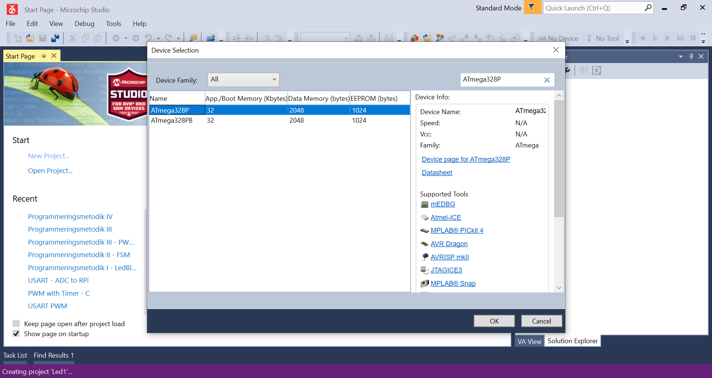

Replace the contents of `main.c` with the real-C equivalent of the sketch from
[C.3](#c3-build-and-test-the-sketch-in-arduino-ide), written to this codebase's conventions:

```c
#include <stdint.h>

#include <avr/io.h>

/** GPIO pins. */
#define LED1 1U // D9  -> PORTB1.
#define BTN1 5U // D13 -> PORTB5.

/** GPIO operations. */
#define LED1_ON PORTB |= (1U << LED1)         // Enable LED1.
#define LED1_OFF PORTB &= ~(1U << LED1)       // Disable LED1.
#define BTN1_IS_PRESSED (PINB & (1U << BTN1)) // High if BTN1 is pressed, low otherwise.

/**
 * @brief Set up system.
 */
static void setup(void)
{
    // Configure LED1 as output.
    DDRB = (1U << LED1);

    // Configure BTN1 as input with its pull-up enabled.
    PORTB = (1U << BTN1); // D13 as input, pull-up enabled
}

/**
 * @brief Application entry point.
 *
 * @return 0 on termination of the program (should never occur).
 */
int main(void)
{
    setup();

    while (1)
    {
        // Read BTN1, enable LED1 if pressed, disable if not.
        if (BTN1_IS_PRESSED) { LED1_ON; }
        else { LED1_OFF; }
    }
    return 0;
}
```

Then build it: `Build → Build Solution`.

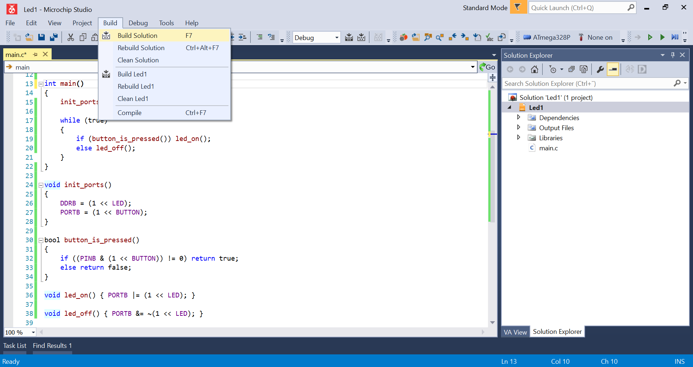

The screenshots for this walkthrough were taken against an earlier draft of `main.c` with plain
(non-`static`) functions and no Doxygen comments; the *code shown above* is what you should
actually type in; the IDE mechanics (menus, dialogs, build steps) are otherwise identical.

---

## C.8 Wire up the External Tool
Programming the chip externally requires the Advanced UI profile: `Tools → Select Profile`, choose
**Advanced**, then **Apply**.

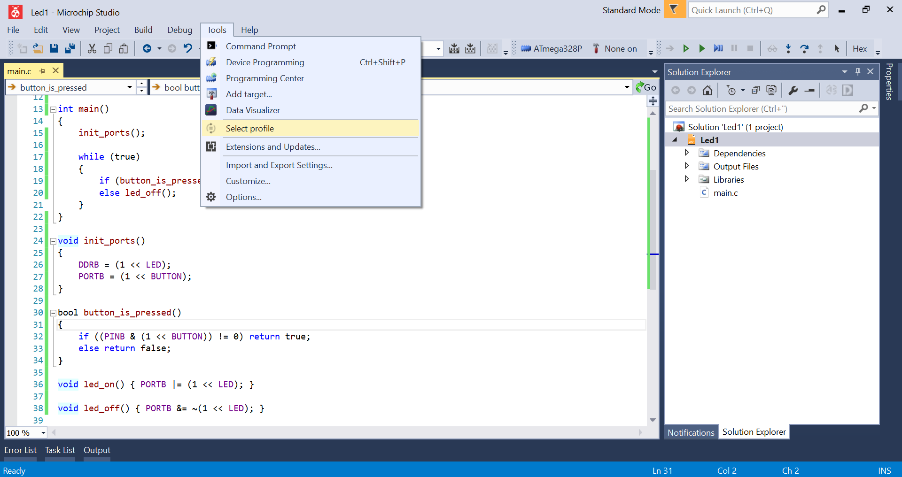

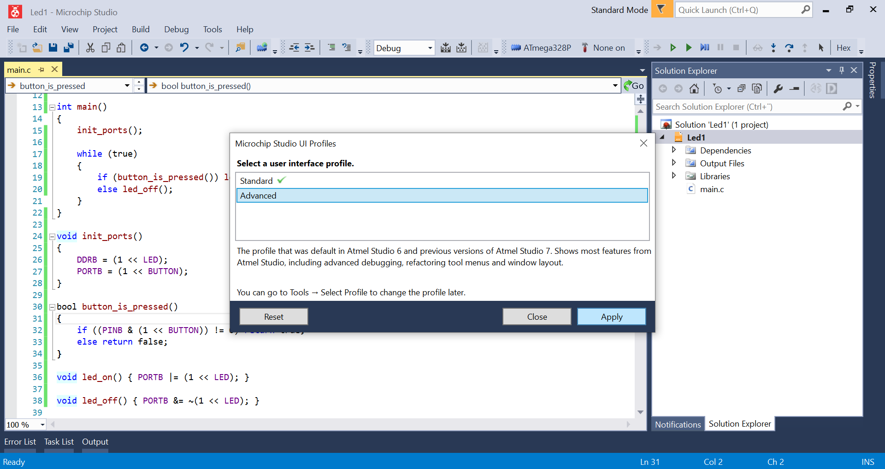

Now create the External Tool entry: `Tools → External Tools`.

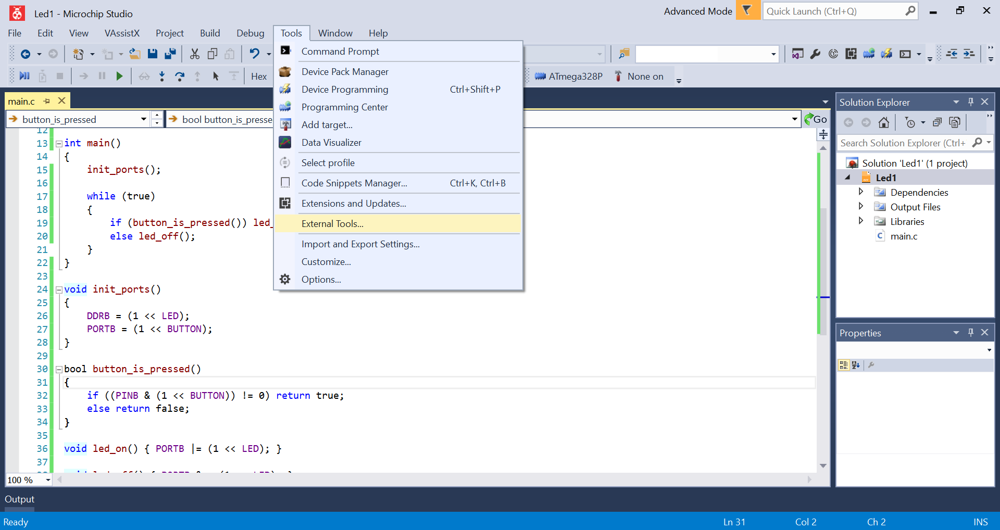

In the dialog that appears, click **Add**. Title it `Arduino` followed by the COM port used earlier
in the Arduino IDE: e.g. `Arduino - COM4`. Paste the first line from `Arduino via Microchip
Studio.txt` into **Command**, and the second line into **Arguments**. Check **Use Output Window**,
then click **OK**.

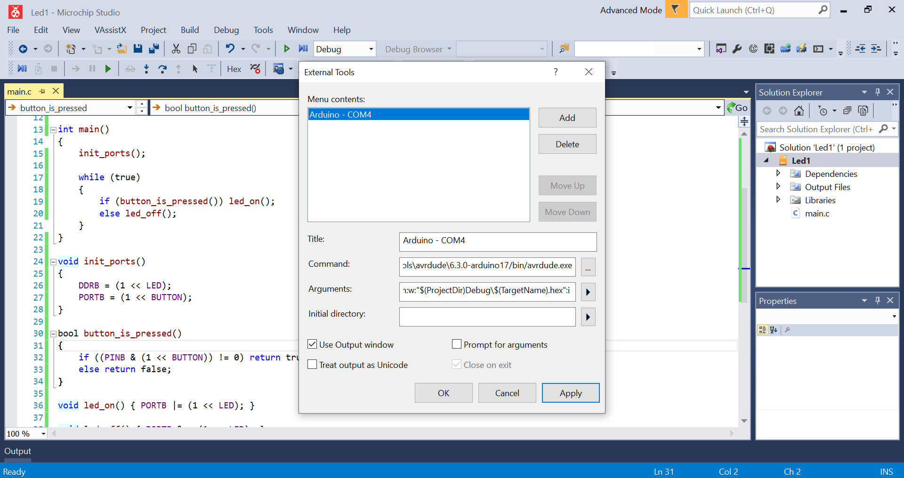

Go back into `Tools` and select the profile you just created (e.g. `Arduino - COM4`).

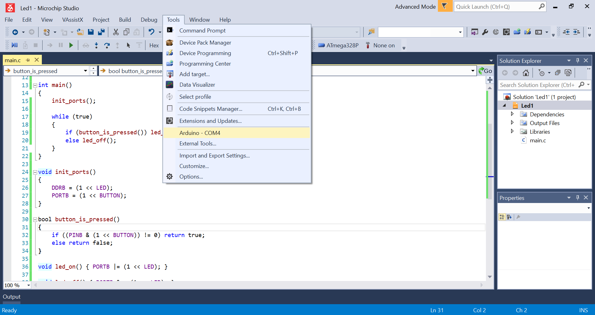

---

## C.9 Flash and verify
If everything worked, the Output window should end with the number of bytes written, e.g.:

```
Writing | ################################################## | 100% 0.05s

avrdude.exe: 194 bytes of flash written
avrdude.exe: safemode: lfuse reads as 0
avrdude.exe: safemode: hfuse reads as 0
avrdude.exe: safemode: efuse reads as 0
avrdude.exe: safemode: Fuses OK (E:00, H:00, L:00)

avrdude.exe done. Thank you.
```

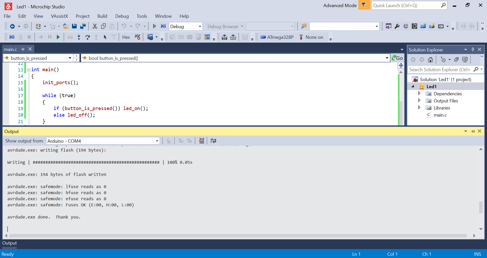

The LED on D9 should now light up while the button on D13 is held, and stay off otherwise. If the
write fails instead, with something like:

```
avrdude.exe: ser_open(): can't open device "\\.\COM4": Det går inte att hitta filen.
```

check that the board is connected, then check the Arduino IDE for its current COM port; if it's
changed, see below.

### If the COM port changes
Reconnecting the board sometimes assigns a different COM port, which surfaces as the same
`ser_open()` error above. The fix is a second External Tool entry, identical to the first except
for the port: back in `Tools → External Tools`, add a new entry (e.g. `Arduino - COM3`), reusing
the same Command, and an Arguments value with `PCOM4` swapped for the new port (e.g. `PCOM3`).

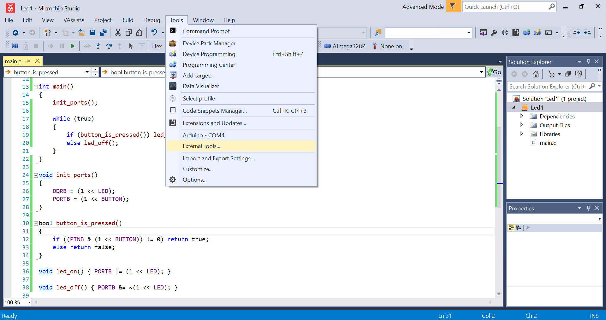

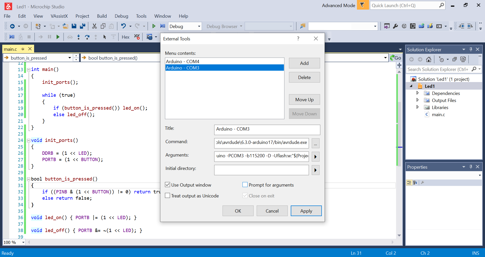

Then select the new profile from `Tools` and run it the same way as before.

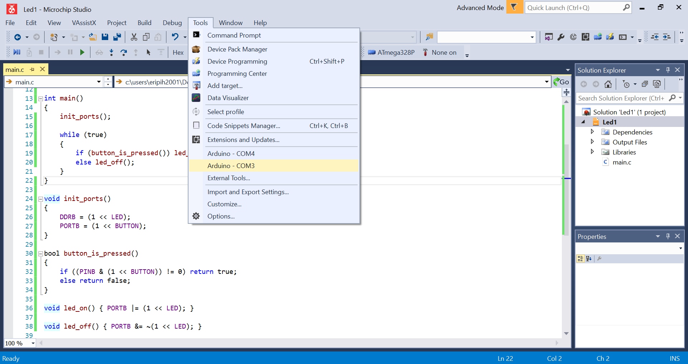

---
