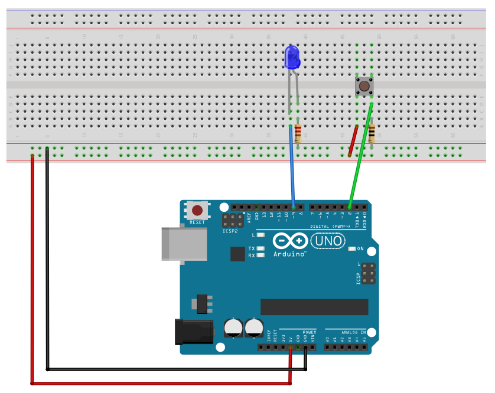
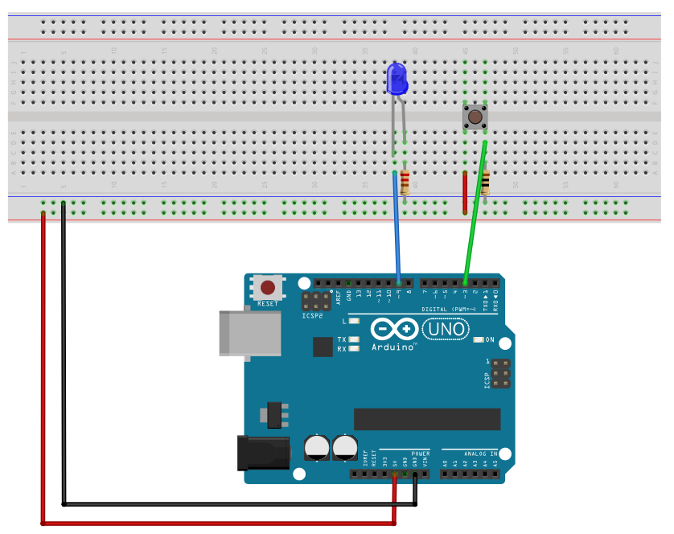
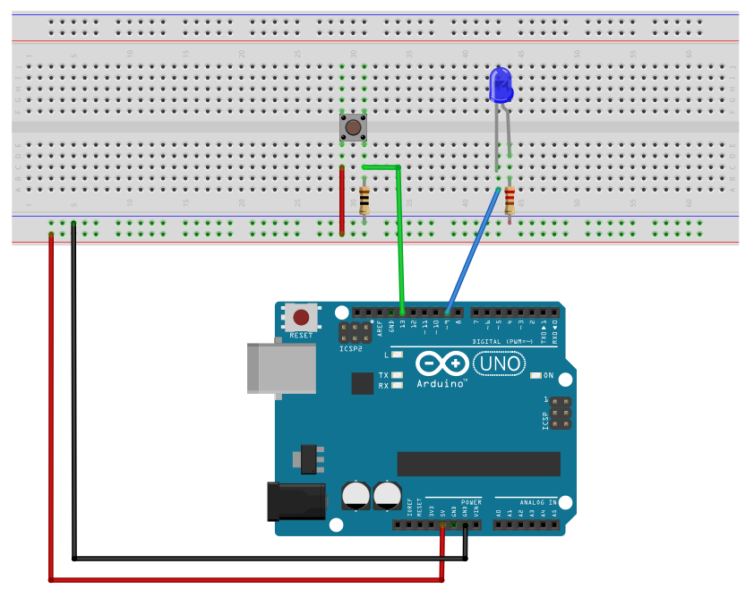

# Appendix A - Interrupts

## A.1 Why interrupts
* Every input we've read so far has been polled: the `while` loop checks `BTN1_PRESSED`
  every iteration. Fine for one button, but it wastes cycles and doesn't scale; imagine polling a
  dozen inputs, or needing sub-millisecond reaction time on one of them while the rest of the
  program does something else entirely.
* An interrupt lets a hardware event (button edge, timer overflow, ADC done, UART byte
  received...) suspend whatever the CPU is doing, run a dedicated handler (an **Interrupt Service
  Routine**, or **ISR**), and then resume exactly where it left off. It's the embedded equivalent
  of an event handler, except the "event loop" is the CPU itself.
* Analogy: an MP3 player's main loop plays the current track. Pressing "next" doesn't get checked
  between every audio sample; it interrupts playback, the ISR queues the next track, and playback
  resumes.
* Because you don't control *when* an ISR fires, keep them short: flip a flag or update a small
  piece of state, and let `main()`'s loop do the actual work. We'll follow that convention
  throughout.

---

## A.2 External interrupts: INT0 / INT1
The ATmega328P has two pins wired straight to dedicated interrupt logic: **INT0** on D2 (PORTD2)
and **INT1** on D3 (PORTD3).

Three things to configure:

1. **Global interrupt enable**, the `I` bit in the status register `SREG`. `<avr/interrupt.h>`
   provides `sei()`/`cli()` for this, thin wrappers around the `SEI`/`CLI` assembly instructions:
   ```c
   sei(); // Enable interrupts globally.
   cli(); // Disable interrupts globally.
   ```
2. **Edge/level selection**, per interrupt, in `EICRA` (bits `ISCn1:ISCn0`):

   | ISCn1:ISCn0 | Triggers on |
   |---|---|
   | `00` | pin is low |
   | `01` | any logic change |
   | `10` | falling edge (high→low) |
   | `11` | rising edge (low→high) |

   ```c
   EICRA = (1U << ISC00) | (1U << ISC01); // Enable INT0 on rising edge.
   ```
3. **Enable the specific interrupt** in `EIMSK`:
   ```c
   EIMSK = (1U << INT0);
   ```

The handler itself is a function named `ISR`, parameterized by a *vector* that ties it to a
specific interrupt source, `INT0_vect` for INT0, `INT1_vect` for INT1. No prototype, no explicit
call site; the vector is how the linker wires it up.

```c
ISR(INT0_vect)
{
    // Runs on the configured edge, then execution resumes exactly where the main program 
    // was interrupted.
}
```

---

## A.3 Example: toggle an LED via INT0
Button on D2 (INT0, rising edge), LED on D9. Every press flips the LED.



```c
#include <avr/interrupt.h>
#include <avr/io.h>

/** GPIO pins. */
#define LED1 1U // D9  -> PORTB1.

/** GPIO operations. */
#define LED1_TOGGLE PINB = (1U << LED1) // Toggle LED1.

/**
 * @brief Set up system.
 */
static void setup(void)
{
    // Configure LED1 as output.
    DDRB = (1U << LED1);

    // Enable rising edge interrupt on INT0 (D2) => button pressdown will cause an interrupt.
    EICRA = (1U << ISC00) | (1U << ISC01);
    EIMSK = (1U << INT0);

    // Enable interrupts globally.
    sei();
}

/**
 * @brief Toggle the LED on button event.
 */
ISR(INT0_vect) { LED1_TOGGLE; }

/**
 * @brief Application entry point.
 *
 * @return 0 on termination of the program (should never occur).
 */
int main(void)
{
    setup();
    while (1) {}
    return 0;
}
```

**Why `LED1_TOGGLE` writes to `PINB`, not `PORTB`.** `PINx` registers are normally read-only:
reading `PINB` returns the actual logic level currently on each of Port B's pins, regardless of
whether they're configured as inputs or outputs. But writing a `1` to a `PINxn` bit is a
documented exception: on this chip (and other modern AVR cores), it *toggles* the corresponding
`PORTxn` bit instead of doing nothing, independent of that pin's `DDRxn` setting. Only the bits
written as `1` are affected; any `0` bits in the write leave their `PORTx` counterpart untouched.

This isn't a hack, it's a deliberate hardware feature, and it exists because a toggle written the
"obvious" way, `PORTB ^= (1U << LED1);`, is a read-modify-write: the CPU reads `PORTB`, flips the
bit, then writes the result back. If an interrupt changes another bit in `PORTB` between that read
and that write, the interrupt's change gets silently overwritten once the write completes. Writing
to `PINB` instead needs no read at all, so there's no window for that race; the toggle is atomic no
matter what else might be touching `PORTB`.

INT1 on D3 works identically for configuration; swap `ISC00`/`ISC01` for `ISC10`/`ISC11`, `INT0`
for `INT1` in `EIMSK`, and `INT0_vect` for `INT1_vect`. A.4 walks through a full example.

---

## A.4 Example: blink an LED via INT1
Button on D3 (INT1, falling edge, i.e. on release), LED on D9. Each press/release cycle toggles
between the LED blinking every 100 ms and staying off.



```c

#define F_CPU 16000000UL // CPU frequency in Hz.

#include <stdbool.h>
#include <stddef.h>
#include <stdint.h>

#include <avr/interrupt.h>
#include <avr/io.h>
#include <util/delay.h>

/** GPIO pins. */
#define LED1 1U // D9 -> PORTB1.

/** GPIO operations. */
#define LED1_ON PORTB |= (1U << LED1)   // Enable LED1.
#define LED1_OFF PORTB &= ~(1U << LED1) // Disable LED1.

/** Time parameters. */
#define TICK_1MS 1U         // Generate a 1 ms tick in delay_ms().
#define BLINK_SPEED_MS 100U // Blink speed in ms.

/** Blink state (true = blinking, false = off); shared with the ISR, see below. */
static volatile bool blink_state = false;

/** Current blink speed in ms; also shared with the ISR. */
static volatile uint16_t blink_speed_ms = 0U;

/**
 * @brief Set up system.
 */
static void setup(void)
{
    // Configure LED1 as output.
    DDRB = (1U << LED1);

    // Enable falling edge interrupt on INT1 (D3).
    EICRA = (1U << ISC11);
    EIMSK = (1U << INT1);

    // Enable interrupts globally.
    sei();
}

/**
 * @brief Generate delay.
 *
 * @param[in] ms Duration in ms.
 *
 * @note A pointer is used so that the duration can be set to 0 on blink state change.
 */
static void delay_ms(const volatile uint16_t* ms)
{
    // Null check included to demonstrate the practice; ms is only ever passed as
    // &blink_speed_ms below, so this never actually triggers. Both this check and the
    // <stddef.h> include it needs (for NULL) can be omitted.
    if (NULL == ms) { return; }

    for (uint16_t i = 0U; i < *ms; ++i)
    {
        _delay_ms(TICK_1MS);
    }
}

/**
 * @brief Blink the LED.
 */
static void led_blink(void)
{
    LED1_ON;
    delay_ms(&blink_speed_ms);
    LED1_OFF;
    delay_ms(&blink_speed_ms);
}

/**
 * @brief Toggle the blink state on button event, update the blink speed accordingly.
 */
ISR(INT1_vect)
{
    blink_state    = !blink_state;
    blink_speed_ms = blink_state ? BLINK_SPEED_MS : 0U;
}

/**
 * @brief Application entry point.
 *
 * @return 0 on termination of the program (should never occur).
 */
int main(void)
{
    setup();

    while (1)
    {
        if (blink_state) { led_blink(); }
        else { LED1_OFF; }
    }
    return 0;
}
```

**Why `blink_state` and `blink_speed_ms` are `volatile`.** Both are written inside
`ISR(INT1_vect)` and read elsewhere: `blink_state` in `main()`'s loop, `blink_speed_ms` via the
pointer `delay_ms()` dereferences. Without `volatile`, the compiler is free to assume a variable
never changes on its own between two reads in the same function, and is allowed to cache it in a
register once instead of re-reading memory every time; it has no way to know an interrupt can run
between those reads and change the value. Skipping `volatile` here wouldn't necessarily fail
right away, either: the loop might work fine at low optimization levels and only start ignoring
button presses once a build enables optimizations aggressive enough to actually act on that
caching assumption, which is exactly the kind of bug that's miserable to track down later.
`volatile` tells the compiler to always re-read (or re-write) the variable from memory, never to
assume its value between accesses. L05 and L06 both reuse this same pattern for their own
ISR-shared variables.

**Why `delay_ms()` takes a pointer, not a plain `uint16_t`.**
[L01 Appendix A.7](../../L01/appendix/a_c_fundamentals.md#a7-pointers-the-one-thing-thats-actually-different)
introduced pointers as C's way to let a function reach into the caller's own object instead of
working on a private copy, there, so a function could write an out-parameter (`*x = 3;`). This is
the same mechanism, used the other way around: `delay_ms(&blink_speed_ms)` doesn't hand the
function `blink_speed_ms`'s value, it hands over its *address*, so every `*ms` inside the loop
re-reads whatever `blink_speed_ms` currently holds, not a value frozen at the moment `delay_ms()`
was called.

That distinction matters here specifically because `blink_speed_ms` can change out from under
`delay_ms()` mid-delay, the ISR overwrites it the instant a press or release happens. Had
`delay_ms()` taken `const uint16_t ms` by value instead, it would have received a private copy at
call time and stayed blind to the ISR's update for the rest of the delay. With a pointer, the very
next `i < *ms` check after the ISR runs sees the new value, so a press/release is noticed within
about one 1 ms tick instead of waiting for the whole delay to finish first.

This live-reading trick relies on the same `volatile` guarantee explained above: without it, the
compiler could assume `*ms` never changes across loop iterations and cache it in a register
instead of re-reading memory each time, silently defeating the exact behavior this pointer
parameter exists to enable.

The blink itself still uses a blocking `_delay_ms()` loop, same as L02's hand-rolled delay; this
lecture only changes *how* the toggle is triggered, not how the blink timing works. Non-blocking
timing is the Timers lecture's (L05) subject.

---

## A.5 Pin Change Interrupts (PCI) for any other pin
INT0/INT1 only cover two physical pins. Every other pin can still trigger an interrupt via **Pin
Change Interrupts**, at the cost of some extra bookkeeping:

* PCI interrupts are grouped **by port, not by pin**: all of PORTB shares one vector
  (`PCINT0_vect`), all of PORTC shares another (`PCINT1_vect`), all of PORTD a third
  (`PCINT2_vect`). Enable PCI on two pins in the same port and both fire the *same* ISR; the
  vector alone doesn't tell you which pin changed.
* PCI fires on **both** edges (press and release); there's no edge-select register like `EICRA`
  for it. If you only care about one edge, check the pin's actual level inside the ISR and ignore
  the call otherwise.

Configuration, per port:

| Port | Enable bit (`PCICR`) | Mask register | Bit-name formula |
|---|---|---|---|
| B (D8–D13) | `PCIE0` | `PCMSK0` | `PCINTx = PORTBx` |
| C (A0–A5) | `PCIE1` | `PCMSK1` | `PCINTx = PORTCx + 8` |
| D (D0–D7) | `PCIE2` | `PCMSK2` | `PCINTx = PORTDx + 16` |

Example: button on D13 (PORTB5) → `PCINT5`.



```c
#include <avr/interrupt.h>
#include <avr/io.h>

/** GPIO pins. */
#define LED1 1U // D9  -> PORTB1.
#define BTN1 5U // D13 -> PORTB5.

/** GPIO operations. */
#define LED1_TOGGLE PINB = (1U << LED1)    // Toggle LED1.
#define BTN1_PRESSED (PINB & (1U << BTN1)) // High if BTN1 is pressed, false otherwise.

/**
 * @brief Set up system.
 */
static void setup(void)
{
    // Configure LED1 as output.
    DDRB = (1U << LED1);

    // Configure BT1N as input with its internal pull-up enabled.
    PORTB = (1U << BTN1);

    // Enable pin change interrupt on D13 (for BTN1).
    PCICR  = (1U << PCIE0);
    PCMSK0 = (1U << BTN1);

    // Enable interrupts globally.
    sei();
}

/**
 * @brief Toggle the LED on rising button edge.
 */
ISR(PCINT0_vect)
{
    if (BTN1_PRESSED) { LED1_TOGGLE; }
}

/**
 * @brief Application entry point.
 *
 * @return 0 on termination of the program (should never occur).
 */
int main(void)
{
    setup();
    while (1) {}
    return 0;
}
```

---

## A.6 PCI on any port: the general pattern
A.5's port B example generalizes directly to ports C and D: only the enable bit, mask register,
and vector change, following the same formula table from A.5.

| Port | Enable (`PCICR`) | Mask register | Vector |
|---|---|---|---|
| B | `PCICR = (1U << PCIE0);` | `PCMSK0 = (1U << PCINTx);` | `ISR(PCINT0_vect)` |
| C | `PCICR = (1U << PCIE1);` | `PCMSK1 = (1U << PCINTx);` | `ISR(PCINT1_vect)` |
| D | `PCICR = (1U << PCIE2);` | `PCMSK2 = (1U << PCINTx);` | `ISR(PCINT2_vect)` |

Worked example: a button on D2 (`PORTD2`) needs port D's enable bit and mask register, and its
ISR is tied to `PCINT2_vect`:

```c
#define BTN2 2U // D2 -> PORTD2.

static void setup(void)
{
    // ...
    PCICR = (1U << PCIE2);  // Enable PCI on port D.
    PCMSK2 = (1U << BTN2);  // Specifically D2 / PORTD2.
    sei();                  // Enable interrupt globally.
}

ISR(PCINT2_vect) // Shared by every enabled PCI pin on port D.
{
    // ...
}
```

`PCMSKn`'s bit position always matches the pin's own bit position within its port
(`DDRx`/`PORTx`/`PINx`); A.5's `PCINTx = PORTDx + 16`-style formula only matters for computing
the *global* `PCINTx` number (useful for looking a pin up in the datasheet), not for what bit to
actually set in `PCMSKn`. So `PCMSK2 = (1U << BTN2)` above sets exactly the same bit as
avr-libc's named `PCMSK2 = (1U << PCINT18)` would; defining your own pin-bit macro, the same
convention A.5 already used for `BTN1`, skips the global-number lookup entirely. Same idea for a
button on D7 (`PORTD7`): `PCMSK2 = (1U << 7)` sets the same bit as `(1U << PCINT23)`, no formula
needed.

The same button on A0 (`PORTC0`) instead needs `PCIE1` / `PCMSK1`, and an `ISR(PCINT1_vect)`.

---

## A.7 Choosing between INT0/INT1 and PCI
* Need a specific edge (rising *or* falling, not both) and don't mind being limited to D2/D3? Use
  INT0/INT1; it's simpler, and the edge filtering happens in hardware.
* Need any other pin, or don't care which edge? Use PCI, and filter edges yourself by reading the
  pin level in the ISR, as above.
* Multiple PCI sources on the same port share an ISR, and if you have more than one, the handler
  needs to work out which pin actually changed (e.g. by keeping a "previous state" byte and
  XOR-ing it against the current `PINx` read to see which bit flipped).

---
