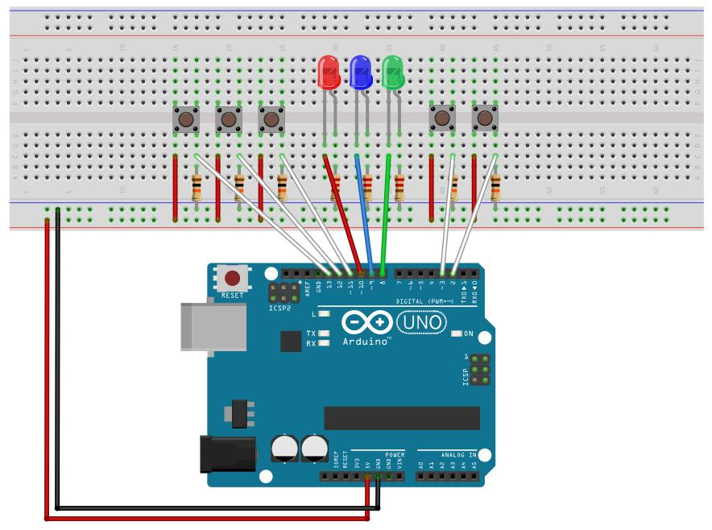

# Appendix B - Exercises

## Concepts
**1.** In your own words (2-3 sentences), explain why polling `BTN1_PRESSED` in a `while`
loop scales poorly once you have several inputs to watch, and how interrupts solve that.

---

**2.** What does `EICRA` configure that `EIMSK` doesn't? Could you enable INT0 without touching
`EICRA` at all; what would happen if you did?

---

## INT0/INT1
**3.** Rewire the lecture's INT0 example (button on D2) to use **INT1** on D3 instead. Write out
the three configuration lines that change.

---

**4.** A colleague configures `EICRA` for a falling edge instead of rising, but leaves the rest of
the INT0 example unchanged, and complains the LED toggles when the button is *released*, not
pressed. Explain what happened.

---

## Pin Change Interrupts
**5.** A project needs an interrupt on D4. Work out, from the formula table in the lecture, which
`PCINT` number that is, which port group it belongs to, and which three registers/bits need to be
touched to enable it.

---

**6.** Two buttons are wired to D11 and D12 (both PORTB). Both are configured via PCI and share
`PCINT0_vect`. Sketch how a single ISR could tell which button changed, using a "previous state"
byte compared against the current `PINB` read.

---

## Program
**7.** Wire up an LED on D6 and a button on D4. Using a Pin Change Interrupt (not INT0/INT1) on
the button, write a complete program, from scratch, that:
* Starts with the LED off and blinking disabled.
* Each button press toggles between two states: blinking (LED on/off every 200 ms) and disabled
  (LED held off).
* The ISR only flags that the button was pressed, filtering the release edge the same way as the
  lecture's PCI example; the actual state toggle and the blink timing both happen in `main()`.

You'll need a blocking delay for the blink timing itself (`_delay_ms()`, as in L02); non-blocking
delays are the Timers lecture's (L05) subject, not this one. The lecture's own A.4 (blink an LED
via INT1) is the closest worked example to lean on.

---

**8.** Build a 5-state state machine, driven entirely by interrupts, using every kind covered in
this lecture at once.

Wire up three LEDs, `LED1` on D8, `LED2` on D9, and `LED3` on D10, plus five buttons. Declare the
five states as an `enum` (`STATE_OFF`, `STATE_SLOW`, `STATE_MEDIUM`, `STATE_FAST`, `STATE_ON`),
and wire each button as follows, advancing/rewinding with wraparound at both ends of the range:
* `BTN1` on D2 (**INT0**, falling edge) is a reset: jump straight to `STATE_OFF`, ignoring the
  normal advance/rewind stepping.
* `BTN2` on D3 (**INT1**, rising edge) rewinds the state by two steps.
* `BTN3` on D11 (**PCI**) rewinds the state by one step.
* `BTN4` on D12 (**PCI**) advances the state by one step.
* `BTN5` on D13 (**PCI**) advances the state by two steps.

The three LEDs' behavior depends on the current state:
* `STATE_OFF`: all three LEDs held off.
* `STATE_SLOW` / `STATE_MEDIUM` / `STATE_FAST`: the three LEDs chase in a loop (`LED1` → `LED2` →
  `LED3` → `LED1` ...), lighting exactly one at a time, holding each for 500 ms / 250 ms / 50 ms
  respectively.
* `STATE_ON`: all three LEDs held on.

As with every other example in this lecture, keep each ISR minimal: flag which button fired (and,
for the three PCI buttons sharing one vector, work out *which* pin changed, as in exercise 6), and
let `main()` do the actual work of updating `state` and driving the LEDs.

---
