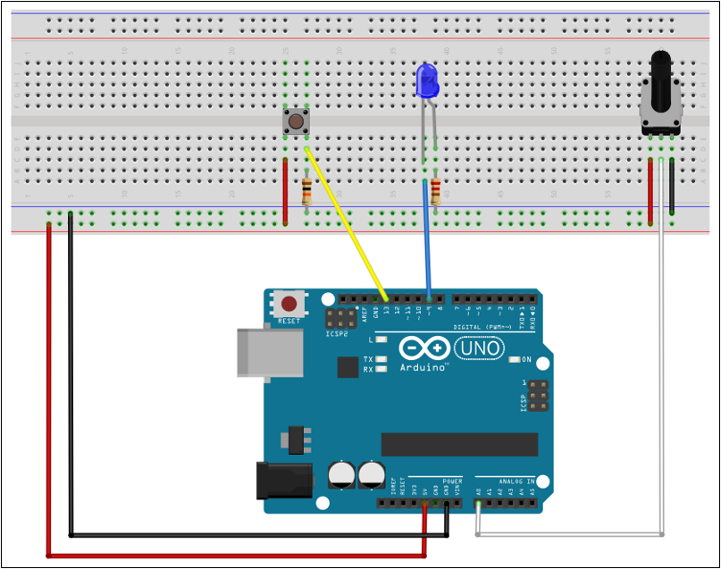

# Appendix A - Timers

## A.1 Why timers
In the previous examples, a function `delay_ms()` has been used to generate delays between LED
blinks and PWM pulses:

```c
/**
 * @brief Generate delay.
 *
 * @param[in] ms Delay duration in ms.
 */
static void delay_ms(const uint16_t ms)
{
    for (uint16_t i = 0U; i < ms; ++i)
    {
        _delay_ms(TICK_1MS);
    }
}
```

This function works as intended, but it has some flaws:
* `_delay_ms()` blocks: the CPU sits in a busy-loop doing nothing else for the duration. Fine for a
  two-line demo, not for anything that also needs to poll a button, read a sensor, or respond to
  interrupts while "waiting."
* To avoid CPU blocks, a timer circuit can be used that flags when the given duration has passed,
  i.e. when timeout occurs.
* A timer is hardware that counts up on its own, driven by the CPU clock (divided down by a
  **prescaler**), completely independent of your code. Configure it once and it can either be
  polled, or, more usefully, fire an interrupt when it reaches a target value, letting you build
  non-blocking delays and precise periodic events.
* The ATmega328P has three: **Timer 0** and **Timer 2** are 8-bit (count 0–255), **Timer 1** is
  16-bit (count 0–65535). Their registers follow a consistent naming pattern; swap the digit
  (`0`/`1`/`2`) and everything else is the same.

---

## A.2 The math: prescaler → tick time → interrupt count
Pick a **prescaler** (a clock divider) to get a manageable tick rate. At 16 MHz with a ÷1024
prescaler:

```
tick frequency = 16,000,000 / 1024 ≈ 15,625 Hz
tick period    = 1 / 15,625 ≈ 0.064 ms
```

For an 8-bit timer, one full count (0→255, i.e. 256 ticks) triggers one **overflow**. To get a
specific delay, work out how many overflows you need:

```
ticks needed     = desired_delay_ms / tick_period_ms
overflows needed = ticks needed / 256          (8-bit timer)
```

E.g. a 100 ms delay at 0.064 ms/tick needs ~1562 ticks ≈ 6 overflows. You don't have to hit this
exactly with a single hardware compare; instead count overflow interrupts in software and act once
you've counted enough. That's the pattern in the example below.

Prescaler bit combinations for Timer 0 / Timer 1 are shown below:

| Prescaler bits | Divisor | Tick @ 16 MHz |
|---|---|---|
| `001` | 1 | 62.5 ns |
| `010` | 8 | 0.5 µs |
| `011` | 64 | 4 µs |
| `100` | 256 | 16 µs |
| `101` | 1024 | 64 µs |

Timer 2's prescaler bit values differ somewhat:

| Prescaler bits | Divisor | Tick @ 16 MHz |
|---|---|---|
| `001` | 1 | 62.5 ns |
| `010` | 8 | 0.5 µs |
| `011` | 32 | 2 µs |
| `100` | 64 | 4 µs |
| `101` | 128 | 8 µs |
| `110` | 256 | 16 µs |
| `111` | 1024 | 64 µs |

---

## A.3 Normal Mode vs. CTC Mode
There are two modes that will be covered in this lecture:
* **Normal Mode**: the timer always counts to its full range (255 or 65535) before overflowing and
  firing `TIMERn_OVF_vect`.
* **CTC Mode** (Clear Timer on Compare): the timer counts up to a value *you* choose (written to
  `OCRnA`), fires `TIMERn_COMPA_vect`, and resets to 0, useful when the period you want doesn't
  cleanly divide into 256 or 65536 ticks.

Both need the same three steps: enable interrupts globally, set the prescaler, and (for CTC) set
the compare value and the mode bit.

---

## A.4 Non-blocking blink using Timer 0 (Normal Mode)
LED on D9 blinks at approximately every 500 ms; no `_delay_ms()` anywhere, so the rest of
`main()`'s loop stays free to do other work.



```c
#include <stdint.h>

#include <avr/interrupt.h>
#include <avr/io.h>

/** GPIO pins. */
#define LED1 1U // D9 -> PORTB1

/** GPIO operations. */
#define LED1_TOGGLE PINB = (1U << LED1) // Toggle LED1.

/** Time parameters. */
#define TICK_PERIOD_MS 0.064F // Tick period, prescaler 1024.
#define TICK_MAX 256U         // Ticks per overflow when using an 8-bit timer.
#define TIMEOUT_MS 500U       // Timeout in ms.

/** Limit parameters; ticks and overflows needed for the desired timeout. */
#define OVF_PERIOD_MS (TICK_PERIOD_MS * TICK_MAX)            // Time between each overflow in ms.
#define OVF_MAX (uint8_t)(TIMEOUT_MS / OVF_PERIOD_MS + 0.5F) // Timeout measured in overflows.

/**
 * @brief Set up system.
 */
static void setup(void)
{
    // Configure LED1 as output.
    DDRB = (1U << LED1);

    // Enable overflow interrupt for timer 0, use prescaler 1024.
    TCCR0B = (1U << CS00) | (1U << CS02);
    TIMSK0 = (1U << TOIE0);
    sei();
}

/**
 * @brief Count overflows, toggle LED1 on timeout.
 */
ISR(TIMER0_OVF_vect)
{
    static volatile uint8_t ovf_count = 0U;

    // Increment the overflow counter, toggle LED1 and clear the counter on timeout.
    if (OVF_MAX <= ++ovf_count)
    {
        LED1_TOGGLE;
        ovf_count = 0U;
    }
}

/**
 * @brief Application entry point.
 *
 * @return 0 on termination of the program (should never occur).
 */
int main(void)
{
    setup();
    while (1) {}
    return 0;
}
```

`TICK_MAX` and `OVF_MAX` are the calculation macros covered in
[L01 Appendix A.12](../../L01/appendix/a_c_fundamentals.md#a12-macros-define): `TICK_MAX`
parenthesizes its whole body the way `TICKS_NEEDED` does there, and `OVF_MAX` gets the same safety
from its leading `(uint8_t)` cast instead, a cast binds as tightly as a parenthesized expression,
so wrapping the division in one has the same effect as an extra pair of parens would.

`ovf_count` here is a function-local `static` variable, scoped entirely inside the ISR: nothing
outside `ISR(TIMER0_OVF_vect)` ever touches it. That means `volatile` isn't actually load-bearing
on this specific variable, the compiler can already see every read and write to `ovf_count` within
this one function body, unlike A.5's `led_state`/`led1_lit` below, which genuinely are shared
across two different ISRs and need it. Leaving `volatile` on here is a harmless habit; the moment
to actually rely on it is the moment something outside this ISR needs to read `ovf_count` too.

---

## A.5 Timer 1 in CTC Mode (16-bit, arbitrary period)
Same idea, but Timer 1's extra range plus CTC mode let you hit a period directly, without stacking
overflow counts except for very long delays. Register names swap the `0` for a `1`; CTC needs one
extra bit, `WGM12`, to select CTC instead of Normal Mode.

`OCR1A` counts from `0` up to the value you write, so it takes `(OCR1A + 1)` ticks to reach it and
fire a compare-match interrupt. To hit a specific timeout, work out how many ticks that timeout
needs, then subtract one:

```
ticks needed = timeout_ms / TICK_PERIOD_MS
OCR1A        = ticks needed - 1
```

E.g. for a 100 ms timeout at a 0.064 ms tick (÷1024 prescaler): `100 / 0.064 = 1562.5` ticks
needed, which would be rounded to 1563. So `OCR1A = 1563 - 1 = 1562`, the value written below:

```c
#define TIMEOUT_MS 100U                            // Timeout in ms.
#define TICK_PEROID_MS 0.064F                      // Tick period, prescaler 1024.
#define CMP_MAX (TIMEOUT_MS / TICK_PERIOD_MS - 1U) // Compare value.
#define TICK_MAX (uint16_t)(CMP_MAX + 0.5F)        // Rounded compare value.

TCCR1B = (1U << CS10) | (1U << CS12) | (1U << WGM12); // Set 1024 prescaler, use CTC mode.
OCR1A  = TICK_MAX;                                    // Set timeout to 100 ms.
TIMSK1 = (1U << OCIE1A);                              // Enable compare-match interrupt.
```

Timer 1's 16-bit range means `1562` fits directly; Timer 0's 8-bit range (max `255`) couldn't hold
a value that large, which is exactly why A.4 had to count multiple overflows in software instead.

Two LEDs on D9/D10 alternate once every 100 ms while enabled; a button on D13 toggles them on and
off entirely, cutting the LEDs immediately rather than waiting for the next compare match:


```c
#include <stdbool.h>

#include <avr/interrupt.h>
#include <avr/io.h>

#define LED1 1U // D9  -> PORTB1.
#define LED2 2U // D10 -> PORTB2.
#define BTN1 5U // D13 -> PORTB5.

/** GPIO operations. */
#define LED1_ON PORTB |= (1U << LED1)                    // Enable LED1.
#define LED1_OFF PORTB &= ~(1U << LED1)                  // Disable LED1.
#define LED2_ON PORTB |= (1U << LED2)                    // Enable LED2.
#define LED2_OFF PORTB &= ~(1U << LED2)                  // Disable LED2.
#define LEDS_OFF PORTB &= ~((1U << LED1) | (1U << LED2)) // Disable both LEDs.
#define BTN1_PRESSED (PINB & (1U << BTN1))               // High if BTN1 is pressed, low otherwise.

/** Time parameters. */
#define TIMEOUT_MS 100U                            // Timeout in ms.
#define TICK_PERIOD_MS 0.064F                      // Tick period, prescaler 1024.
#define CMP_MAX (TIMEOUT_MS / TICK_PERIOD_MS - 1U) // Compare value.
#define TICK_MAX (uint16_t)(CMP_MAX + 0.5F)        // Rounded compare value.

/** LED state (true = enabled, false = disabled). */
static volatile bool led_state = false;

/** True if LED1 is lit, false otherwise. */
static volatile bool led1_lit = false;

/**
 * @brief Set up system.
 */
static void setup(void)
{
    // Configure LED1 and LED2 as outputs.
    DDRB = (1U << LED1) | (1U << LED2);

    // Configure BTN1 as input with its internal pull-up enabled.
    PORTB = (1U << BTN1);

    // Enable pin change interrupt for BTN1.
    PCICR  = (1U << PCIE0);
    PCMSK0 = (1U << BTN1);

    // Enable timer 1 in CTC mode, set timeout to 100 ms.
    TCCR1B = (1U << CS10) | (1U << CS12) | (1U << WGM12);
    OCR1A  = TICK_MAX;
    TIMSK1 = (1U << OCIE1A);

    // Enable interrupts globally.
    sei();
}

/**
 * @brief Toggle the LEDs on button press.
 */
ISR(PCINT0_vect)
{
    if (BTN1_PRESSED)
    {
        led_state = !led_state;
        if (!led_state) { LEDS_OFF; }
    }
}

/**
 * @brief Alternate which of the two LEDs is lit if enabled.
 */
ISR(TIMER1_COMPA_vect)
{
    // Check the LED state, terminate if disabled.
    if (!led_state) { return; }

    // Alternate which LED is lit.
    led1_lit = !led1_lit;

    if (led1_lit)
    {
        LED1_ON;
        LED2_OFF;
    }
    else
    {
        LED1_OFF;
        LED2_ON;
    }
}

/**
 * @brief Application entry point.
 *
 * @return 0 on termination of the program (should never occur).
 */
int main(void)
{
    setup();
    while (true) {}
    return 0;
}
```

`led_state` and `led1_lit` are `volatile` because they're shared between two different ISRs;
each one needs to see the other's latest write, the same reasoning as A.4's `ovf_count`, just
between two interrupt handlers instead of an ISR and `main()`.

Timer 2 mirrors Timer 0 (8-bit, Normal/CTC), with one gotcha: its ÷1024 prescaler bit pattern is
`111`, not `101` as on Timers 0/1.

---
