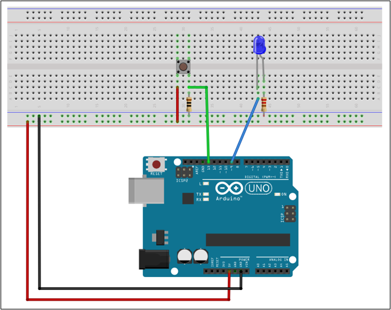

# Appendix A - The Watchdog Timer

## A.1 The watchdog timer: what it is and why
* A watchdog is a second, independent timer with one job: if it isn't reset ("petted") within
  its configured timeout, it resets the entire chip.
* The use cases are:
    * A program that might hang.
    * An infinite loop from a bug.
    * A sensor that never responds.
    * A peripheral wait-loop (like L07 Appendix A.2's `EEPE` wait, or L04's `ADIF` wait) that
      never sees its flag set.
* Without a watchdog, a hang like that freezes the device until someone power-cycles it by hand.
  With one, the chip recovers on its own within one timeout period.
* The watchdog timer follows this pattern:
    * Enable the watchdog with a timeout comfortably longer than one iteration of `main()`'s loop
      normally takes.
    * Reset the watchdog once per iteration of `main()`'s loop.
    * As long as the loop keeps running, the watchdog never fires. The moment it doesn't (because
      something hung), the watchdog's timeout expires and the chip restarts.

---

## A.2 Watchdog registers
One register, **`WDTCSR`** (Watchdog Timer Control and Status Register), controls both enablement
and timeout via bits `WDE` (Watchdog Enable) and `WDP0`-`WDP3` (Watchdog Prescaler, selecting the
timeout duration).

The four prescaler bits, `WDP[3:0]`, set the timeout anywhere from 16 ms up to 8192 ms:

| Timeout | `WDP[3:0]` | Value |
|---|---|---|
| 16 ms   | `0000` | 0  |
| 32 ms   | `0001` | 1  |
| 64 ms   | `0010` | 2  |
| 128 ms  | `0011` | 3  |
| 256 ms  | `0100` | 4  |
| 512 ms  | `0101` | 5  |
| 1024 ms | `0110` | 6  |
| 2048 ms | `0111` | 7  |
| 4096 ms | `1000` | 32 |
| 8192 ms | `1001` | 33 |

The jump from 7 to 32 isn't a typo: `WDP2`-`WDP0` sit at contiguous bits 2-0 of `WDTCSR`, so the
first eight timeouts (16 ms-2048 ms) map straight onto the integers 0-7. `WDP3`, needed for
4096 ms and 8192 ms, lives at bit 5 instead, so those two timeouts land on `1 << 5` (32) and
`(1 << 5) | (1 << 0)` (33).

This maps cleanly onto a plain `enum`: the first eight members can take their default values (0-7,
counting up in declaration order, same as L01 Appendix A.3's `sensor_state_t`), and only the last
two need an explicit value:

```c
typedef enum
{
    WATCHDOG_TIMEOUT_16MS,        ///< 16 ms timeout.
    WATCHDOG_TIMEOUT_32MS,        ///< 32 ms timeout.
    WATCHDOG_TIMEOUT_64MS,        ///< 64 ms timeout.
    WATCHDOG_TIMEOUT_128MS,       ///< 128 ms timeout.
    WATCHDOG_TIMEOUT_256MS,       ///< 256 ms timeout.
    WATCHDOG_TIMEOUT_512MS,       ///< 512 ms timeout.
    WATCHDOG_TIMEOUT_1024MS,      ///< 1024 ms timeout.
    WATCHDOG_TIMEOUT_2048MS,      ///< 2048 ms timeout.
    WATCHDOG_TIMEOUT_4096MS = 32, ///< 4096 ms timeout.
    WATCHDOG_TIMEOUT_8192MS = 33, ///< 8192 ms timeout.
} watchdog_timeout_t;
```

Cast a `watchdog_timeout_t` directly to `uint8_t` and write it to the `WDTCSR` prescaler bits.
Its encoded value places the prescaler bits correctly for all ten timeout settings.

Changing `WDE` or the prescaler bits needs the same kind of timed sequence as EEPROM's
`EEMPE`/`EEPE` from L07, and for the same reason:
* It's a safety interlock, this time specifically so runaway code can't accidentally disable the
one thing meant to catch it. `WDCE` (Watchdog Change Enable) must be set together with `WDE`, and
the real configuration written within 4 cycles:

```c
cli();
WDTCSR |= (1U << WDCE) | (1U << WDE);                      // Unlock the timed sequence.
WDTCSR = (1U << WDE) | (uint8_t)(WATCHDOG_TIMEOUT_1024MS); // Enable watchdog, 1024 ms timeout.
sei();
```

Resetting the countdown doesn't touch `WDTCSR` at all, it's a single dedicated CPU instruction,
`WDR` (Watchdog Reset). Nothing about `WDR` lives behind a register bit, so there's no C
statement (no `WDTCSR |= ...`) that produces it; the only way to emit a specific machine
instruction from C is **inline assembly**, `asm(...)`, which drops a literal instruction straight
into the compiled output, bypassing C entirely for that one line:

```c
asm("WDR");
```

This is the simplest form GCC supports, "basic" inline assembly: just a literal instruction as a
string, no inputs, no outputs, nothing declared as clobbered. (GCC also has "extended" inline
assembly, with input/output operands and clobber lists, for wiring C variables into and out of an
`asm` block; `WDR` doesn't read or write anything C can see, so none of that machinery is needed
here.)

One gotcha: `asm` is a GNU extension, not standard C, recognized only under a GNU dialect
(`-std=gnu11`) or GCC's default mode. This course's demos compile with `-std=c11`, strict ISO C,
where the compiler doesn't know the word `asm` at all and this line fails to build. `__asm__`,
the double-underscore spelling, is always recognized regardless of `-std=`, so that's the form
used from here on:

```c
__asm__("wdr");
```

This course writes straight against the registers instead of reaching for a library, the same as
every peripheral so far (UART, ADC, timers, EEPROM): no header between the code and the
hardware, so nothing about what the chip is actually doing is hidden behind a macro.

```c
#include <avr/io.h>
#include <avr/interrupt.h>

/**
 * @brief Enable the watchdog timer with a 1024 ms timeout.
 */
static void watchdog_enable(void)
{
    cli();
    WDTCSR |= (1U << WDCE) | (1U << WDE);
    WDTCSR = (1U << WDE) | (uint8_t)(WATCHDOG_TIMEOUT_1024MS);
    sei();
}

/**
 * @brief Reset the watchdog timer, restarting its countdown.
 */
static void watchdog_reset(void)
{
    __asm__("wdr");
}
```

---

## A.3 `WDRF`: don't get locked out of disabling the watchdog
A watchdog-caused reset sets `WDRF` (Watchdog Reset Flag) in **`MCUSR`** (MCU Status Register).
That flag isn't just informational: the datasheet has `WDE` read back as set for as long as `WDRF`
is set, no matter what gets written to it. Try to clear `WDE` (or disable the watchdog some other
way) while `WDRF` is still set, and it silently does nothing, the watchdog stays armed and fires
again next timeout.

This is deliberate, not a bug: it stops a chip that just failed and reset from immediately turning
its own safety net back off, which is exactly the failure mode a watchdog exists to catch. The
practical consequence is that `WDRF` must be cleared explicitly, and early, before anything else
touches `WDTCSR`:

```c
MCUSR &= ~(1U << WDRF); // Clear the watchdog reset flag; WDE can't be cleared while it's set.
```

Put this as the first line of `setup()`, unconditionally, before `watchdog_enable()` or any
other watchdog call. Skip it, and a single watchdog-triggered reset can leave the chip unable to
ever turn the watchdog off again, whatever the running code tries to do about it.

---

## A.4 System Reset Mode vs. Interrupt Mode
`WDE` and `WDIE` (Watchdog Interrupt Enable), both in `WDTCSR`, pick what a timeout actually
does, independently of each other:
* `WDE` alone: **System Reset Mode**. Timeout resets the chip, same as A.2's `watchdog_enable()`.
* `WDIE` alone: **Interrupt Mode**. Timeout jumps to `ISR(WDT_vect)` instead of resetting
  anything.
* Both set: timeout fires `ISR(WDT_vect)` *and* clears `WDIE` in hardware on the way in, leaving
  `WDE` armed. Pet the watchdog inside that ISR (or soon after) and the reset never happens; miss
  the next timeout too and the chip resets. That's one warning before the safety net actually
  trips.

Setting the prescaler bits still needs A.2's `WDCE` timed sequence, same as `watchdog_enable()`,
just with `WDE` left at `0` in the value that gets committed. `WDIE` itself isn't behind that
sequence, so it's set separately, straight after:

```c
/**
 * @brief Enable the watchdog in Interrupt Mode: ISR(WDT_vect) runs on timeout instead of a
 *        system reset.
 *
 * @param[in] timeout Timeout to arm the watchdog with (A.2, Table 1).
 */
static void watchdog_enable_interrupt(const watchdog_timeout_t timeout)
{
    watchdog_reset();
    cli();
    WDTCSR |= (1U << WDCE) | (1U << WDE); // Unlock the timed sequence.
    WDTCSR = (uint8_t)(timeout);          // Commit prescaler bits, WDE left at 0.
    sei();
    WDTCSR |= (1U << WDIE);               // Not part of the timed sequence.
}
```

---

## A.5 Worked example: petting the watchdog in L07's demo
Extends [L07 Appendix A.4](../../L07/appendix/a_eeprom.md#a4-worked-example-persisting-led1s-state-across-resets)'s
button-toggles-LED1-and-persists-to-EEPROM demo with a 1024 ms watchdog (System Reset Mode, A.2)
on top. `setup()` calls `watchdog_init(WATCHDOG_TIMEOUT_1024MS)` once; `main()`'s loop calls
`watchdog_reset()` first thing, every iteration, whether or not a button event happened that
iteration, same as A.1's pattern.



```
watchdog_driver_demo/
├── Makefile
├── main.c
├── include/
│   └── driver/
│       ├── eeprom.h
│       ├── serial.h
│       └── watchdog.h
└── source/
    └── driver/
        ├── eeprom.c
        ├── serial.c
        └── watchdog.c
```

The serial and EEPROM drivers were introduced in L06 and L07 respectively.
[driver/watchdog.h](../watchdog_driver_demo/include/driver/watchdog.h) and
[driver/watchdog.c](../watchdog_driver_demo/source/driver/watchdog.c) are A.2's
`watchdog_timeout_t` plus `watchdog_init()`/`watchdog_reset()`, nothing more.

`main.c` in full:

```c
/**
 * @file Watchdog driver demo.
 */
#include <stdbool.h>
#include <stdint.h>

#include <avr/interrupt.h>
#include <avr/io.h>

#include "driver/eeprom.h"
#include "driver/serial.h"
#include "driver/watchdog.h"

#define LED1 1U // D9  -> PORTB1.
#define BTN1 5U // D13 -> PORTB5.

/** GPIO operations. */
#define LED1_TOGGLE PINB = (1U << LED1)    // Toggle LED1.
#define LED1_ENABLED (PINB & (1U << LED1)) // High if LED1 is enabled, low otherwise.
#define BTN1_PRESSED (PINB & (1U << BTN1)) // High if BTN1 is pressed, low otherwise.

/** Timer operations. */
#define TIMER0_ENABLE TIMSK0 = (1U << TOIE0) // Enable timer 0 interrupt.
#define TIMER0_DISABLE TIMSK0 = 0U           // Disable timer 0 interrupt.

/** Interrupt operations. */
#define BTN1_INT_ENABLE PCMSK0 |= (1U << BTN1)   // Enable pin change interrupt for BTN1.
#define BTN1_INT_DISABLE PCMSK0 &= ~(1U << BTN1) // Disable pin change interrupt for BTN1.

/** Time parameters */
#define TICK_PERIOD_MS 0.064F    // Time between each tick, prescaler 1024.
#define TICK_MAX 256U            // Ticks per overflow for 8-bit timer.
#define DEBOUNCE_TIMEOUT_MS 300U // Debounce timeout in ms.

/** Limit parameters. */
#define OVF_TIME_MS (TICK_PERIOD_MS * TICK_MAX)     // Time between each overflow in ms.
#define OVF_MAX (DEBOUNCE_TIMEOUT_MS / OVF_TIME_MS) // Overflows needed for timeout.
#define OVF_TIMEOUT (uint8_t)(OVF_MAX + 0.5F)       // Overflows needed for timeout, rounded.

/** EEPROM parameters. */
#define EEPROM_LED1_ADDR 1000U // EEPROM address containing the LED1 state.
#define EEPROM_LED1_ON 1U      // Stored value indicating that LED1 is on.
#define EEPROM_LED1_OFF 0U     // Stored value indicating that LED1 is off.

/** Flags that a LED1 event has occurred. */
static bool led1_event = false;

/**
 * @brief Print the LED1 state over UART.
 */
static void print_led1_state(void)
{
    if (LED1_ENABLED) { serial_print("LED1 enabled!\n"); }
    else { serial_print("LED1 disabled!\n"); }
}

/**
 * @brief Set up system.
 */
static void setup(void)
{
    // Configure LED1 as output.
    DDRB = (1U << LED1);

    // Configure BTN1 as input with its internal pull-up enabled.
    PORTB = (1U << BTN1);

    // Enable pin change interrupt for BTN1.
    PCICR = (1U << PCIE0);
    BTN1_INT_ENABLE;

    // Set up 300 ms debounce timer.
    TCCR0B = (1U << CS00) | (1U << CS02);

    // Initialize serial driver.
    serial_init();

    // Restore the previous LED state from EEPROM.
    uint8_t led_state = 0U;
    if (sizeof(led_state) == eeprom_read(&led_state, sizeof(led_state), EEPROM_LED1_ADDR))
    {
        if (EEPROM_LED1_ON == led_state) { LED1_TOGGLE; }
    }
    print_led1_state();

    // Initialize watchdog with a 1024 timeout.
    watchdog_init(WATCHDOG_TIMEOUT_1024MS);

    // Enable interrupts globally.
    sei();
}

/**
 * @brief Toggle LED1 and transmit a message over UART on button press.
 *
 *        Disable button interrupts for 300 ms to prevent debounce.
 */
ISR(PCINT0_vect)
{
    // Disable button interrupts for 300 ms.
    BTN1_INT_DISABLE;
    TIMER0_ENABLE;

    // Toggle LED1 and save its new state if BTN1 is pressed.
    if (BTN1_PRESSED)
    {
        LED1_TOGGLE;
        led1_event = true;
    }
}

/**
 * @brief Re-enable button interrupts after 300 ms.
 */
ISR(TIMER0_OVF_vect)
{
    static volatile uint8_t ovf_counter = 0U;

    // Wait for 300 ms, then re-enable button interrupts and disable timer 0.
    if (OVF_TIMEOUT <= ++ovf_counter)
    {
        BTN1_INT_ENABLE;
        TIMER0_DISABLE;
        ovf_counter = 0U;
    }
}

/**
 * @brief Application entry point.
 *
 * @return 0 on termination of the program (should never occur).
 */
int main(void)
{
    setup();

    while (1)
    {
        // Reset the watchdog once every iteration of the loop.
        watchdog_reset();

        // Check if a LED1 event has occurred, store the new state in EEPROM if true.
        if (led1_event)
        {
            const uint8_t led_state = LED1_ENABLED ? EEPROM_LED1_ON : EEPROM_LED1_OFF;
            eeprom_write(&led_state, sizeof(led_state), EEPROM_LED1_ADDR);
            led1_event = false;

            // Report the new LED1 state over UART.
            print_led1_state();
        }
    }
    return 0;
}
```

Try commenting out just the `watchdog_reset();` call and reflashing: nothing about the rest of
the code looks wrong, `setup()` still runs, the button still toggles LED1 and reports over UART,
but roughly every 1024 ms the chip reboots on its own, visible as `setup()`'s LED1-state report
firing over and over in the serial monitor even with nobody touching the button. That's A.1's
watchdog doing exactly what it's for: the timeout wasn't pet in time, so it fired.

Build and flash the same way as
[L06 Appendix A.6](../../L06/appendix/a_uart.md#a6-example-button-toggles-an-led-reports-over-serial):
on Linux, `cd ../watchdog_driver_demo` and run `make` (`make flash` to program the board); on
Windows via Microchip Studio, recreate this folder structure inside the project and add
`include` as an include directory.

---

## A.6 Why no structs here
Both UART (L06), EEPROM (L07) and the watchdog get away with plain functions and no struct,
unlike where this course is headed next. The ATmega328P has exactly one EEPROM and exactly one
watchdog; there's no second instance to distinguish between, no `self` parameter needed, nothing
to bundle. A struct would just be ceremony around state that only ever exists once.

LEDs, buttons, and timers aren't so lucky, a program regularly wants several of each, and L04's
five-LED exercise and L05's three-timer exercise already ran into what that means without a
better tool. That's exactly the gap L09 closes.

---
